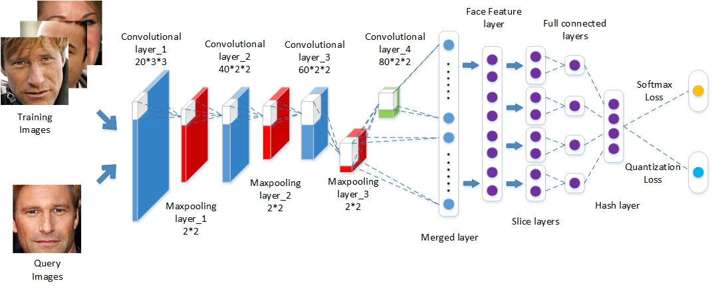

# Keras-Face_Retrieval_method

- [Discriminative Deep Hashing for Scalable Face Image Retrieval](https://www.ijcai.org/proceedings/2017/0315.pdf)(DDH), IJCAI 2017

Created by Jie Lin, Zechao Li and Jinhui Tang at  Nanjing University of Science and Technology, NanJing, China

## DDH

### Introduction

In this work, we propose a novel Discriminative Deep Hashing (DDH) framework for large-scale face image retrieval. The proposed framework leverages feature extraction, hash learning and class prediction in one unified network. And the divide-and-encode module is introduced to reduce the redundancy among hash codes and the network parameters simultaneously. The proposed method can learn discriminative and compact hash codes. Experiments show that the proposed method achieves encouraging retrieval performance. DDH's framework is as follows:



## Prerequisites

1. python 2.7.12
2. Keras 1.2.2
3. Theano 0.8.2

### Data

We compress the dataset into pkl format for easy read by small memory machines.

- YouTube Faces Dataset 

  train_set: https://drive.google.com/open?id=1Of-hUKhQhk3OtCUAZc15pZqEvKHWNUpN

  test_set: https://drive.google.com/open?id=10RuxZuIMfvPN6ziPglJTgS6IWFBzW3pW


- FaceScrub Dataset

  train_set: https://drive.google.com/open?id=1STytImOvad3PgPN2NwUSVga-fOU5i2Tm

  test_set: https://drive.google.com/open?id=1saSeHjaJBSAUNlyC-Ismdh2VbEiyZPuU

### The main parameters

1、For different datasets, you can try different hyper parameters corresponding to regularization and quantization errors. In our experiments, our settings are as follows:

LOSS_01_LAYER_PARAMS = 0.01

REGULARIZER_PARAMS = 0.0001

2、When RUN_OR_CHECK is True, it's train mode, you can set WEIGHTS_SAVE_PATH to set the weight of the save path. It's eval mode when RUN_OR_CHECK is False, you can set WEIGHTS_FILE_NAME to load the best weight.

3、In the eval mode, you can get the result of the precision, recall, map from the 'model_predict' function. 

### Citing our work 

```
@inproceedings{lin2017discriminative,
  title={Discriminative deep hashing for scalable face image retrieval},
  author={Lin, Jie and Li, Zechao and Tang, Jinhui},
  booktitle={Proceedings of International Joint Conference on Artificial Intelligence},
  year={2017}
}
```